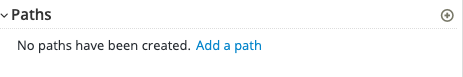

# Introduction

This walkthrough covers the process of designing an API with Apicurio. At the end of the exercise the contract will be signed, allowing the frontend and backend developers to start the development process.

# APICurio

# What is APICurio?

Apicurio Studio, maintained by the Red Hat Developer Program, is a tool for designing APIs that follows the specification without requiring the developer(s) to be intimately familiar with it. It provides a GUI for defining all aspects of the API. Ultimately, Apicurio outputs both human and machine readable documentation which complies with the latest version of the OpenAPI specification.

# Create an account

APICurio offers a SaaS option located at https://studio.apicur.io. Please create an account by Clicking the "Register" button or using an Identity Provider like Google or GitHub.

# APICurio overview

As soon as you are logged into APICurio you will see three main sections.

1. Dashboard (Overall overview, Activity and Recent APIS).
2. APIs
   * View all APIs (Lists the APIs owned and shared with you)
   * Create new API (Allows the creation of a new API)
   * Import API (If we have already one API, we can import it and manage in APICurio)
3. Settings (Custom Settings, Linked Accounts)

# API Specification Requirements

We are going to create an api specification with the following requirementes

* Data Types (Models reused across endpoints):
  * Error
    - code: string
    - extra: string
    - message: string
  * Item
    - id: string
    - name: string
    - description: string
* Endpoints:
  * GET /items
    - Operation ID: getItems
    - Response:
      - Code 200, application/json, Array of Items
  * POST /items
    - Operation ID: createItem
    - Request Body: application/json, Item Object
    - Response:
      - Code 201
  * GET /items/{itemId}
    - Operation ID: getItem
    - Response:
      - Code 200, application/json, Item
  * PUT /items/{itemId}
    - Operation ID: updateItem
    - Request Body: application/json, Item Object
    - Response:
      - Code 202
  * DELETE /items/{itemId}
    - Operation ID: deleteItem
    - Response:
      - Code 204

# ToDo List API Specification creation (Step by Step)

1. Click "APIs" section and Click "Create New API"
2. In servers section, Add a new server:
   1.  Server URL: http://localhost:8001/api/v1
   2.  Description: Local Env Server
   3.  Click "Save"
3. Fill the fields:
   
   1. Name: ToDo API
   2. Description: ToDo API specification
   3. Type: Open API 3.0.2
   4. Template: Blank API

4. Define the Data Types
5. Click "Add a data type" link
   
6. Fill the fields:
   1. Name: Error
   2. Description: Error Object
   3. Enter JSON Example:
   ```
   {
      "code": "ERR001",
      "message": "Error from Server",
      "extra": "Extra error message"
    }
   ```
   1. Choose to create a Rest Resource with the Data Type: No Resource (NOTE: if you click Rest Resource, creates automatically all the paths and methods required to manage the Error object, this is useful for the `Item` object but we are not going to use it. All the creation will be made manually to gain more experience).
7. Click "Save" button.
   
8. You can add descriptions into the `Error` Object properties. Add them.
9.  Now It's your turn, try to do the same with `Items` Object following the requirements.
10. Now It's time to create some paths, we will cover the GET /items.
11. Click Add path:
    
12. Enter the path: /items
13. As soon as the popup is closed you can see the new path. In the detail page, we are going to add some extra information and enable the GET operation.
14. Fill the info section:
    1.  Summary: Path used to manage the list of Items.
    2.  Description: The REST endpoint/path used to list and create zero or more `Item` entities.  This path contains a `GET` and `POST` operation to perform the list and create tasks, respectively.
15. Operations click "Get" button and "Add Operation" buton.
    
16. Fill the following sections:
    1.  Info:
        1.  Summary: List All Items
        2.  Description: Gets a list of all `Item` entities.
        3.  Operation ID: getItems
    2.  Responses:
        1.  Add 200 Status code.
        2.  Description: Successful response - returns an array of `Item` entities.
        3.  Response Body: Add Media Type -> Application/json -> Type: `Array` of `Item`.
        4.  Add 500 Status code.
        5.  Description: Error response - returns an object of `Error` entity.
        6.  Response Body: Add Media Type -> Application/json -> Type: `Error`.
17. Now Create the rest of the endpoints filling the requirements.


