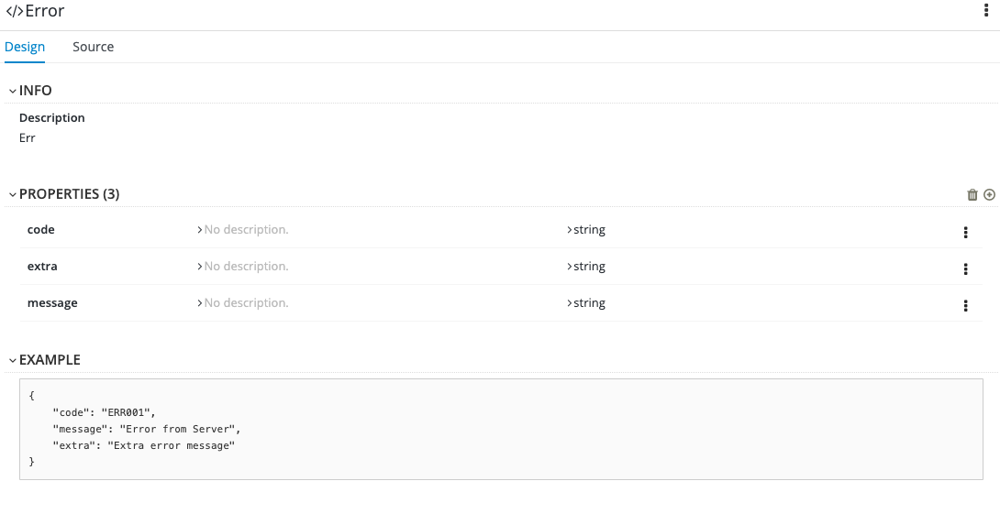

# Introduction
In this exercise, you will define the API to be used for the to-do list application using Apicurio.

> Apicurio Studio, maintained by the Red Hat Developer Program, is a tool for designing APIs that follows the specification without requiring the developer(s) to be intimately familiar with it. It provides a GUI for defining all aspects of the API. Ultimately, Apicurio outputs both human and machine readable documentation which complies with the latest version of the OpenAPI specification.

## Step 1 - Create an account

Apicurio offers a SaaS option located at https://studio.apicur.io. Please create an account by clicking on the **Register** link or using an Identity Provider like Google or GitHub.

## Step 2 - Explore Apicurio

As soon as you are logged into Apicurio you will see three main sections:

1. Dashboard (Overall overview, Activity and Recent APIs).
2. APIs
   * View all APIs (Lists the APIs owned and shared with you)
   * Create new API (Allows the creation of a new API)
   * Import API (If we have already one API, we can import it and manage in Apicurio)
3. Settings (User profile, Linked Accounts)

## Step 3 - Explore requirements for to-do list API 

The API should expose endpoints with the following data models:

* Data Models:
  * Error
    - code: string
    - extra: string
    - message: string
  * Item
    - id: string
    - name: string
    - description: string
* Endpoints:
  * GET /items
    - Operation ID: getItems
    - Response:
      - Code 200, application/json, Array of Items
  * POST /items
    - Operation ID: createItem
    - Request Body: application/json, Item Object
    - Response:
      - Code 201
  * GET /items/{itemId}
    - Operation ID: getItem
    - Response:
      - Code 200, application/json, Item
  * PUT /items/{itemId}
    - Operation ID: updateItem
    - Request Body: application/json, Item Object
    - Response:
      - Code 202
  * DELETE /items/{itemId}
    - Operation ID: deleteItem
    - Response:
      - Code 204

## Step 4 - Define the to-do list API specification with Apicurio

###### 4.1 Go to section _APIs_ and click **Create New API**
  
  * Name: ToDo API
  * Description : ToDo API specification
  * Type: Open API 3.0.2
  * Template: Blank API

###### 4.2. Edit the API, and in servers section, add a new server:
   * Server URL: http://localhost:8001/api/v1
   * Description: Local Env Server
   * Click **Save**

###### 4.3. Define the Data Model "Error"
   

   * Click on the **Add a data type** link
   * Enter the following fields:
       * Name: Error
       * Description: Error Object
       * Enter JSON Example:
       ```
       {
          "code": "ERR001",
          "message": "Error from Server",
          "extra": "Extra error message"
        }
       ```
   * Choose to create a REST Resource with the Data Type: _No Resource`_
   > Note: if you select _REST Resource_, all the paths and methods required to manage the Error data model will be created automatically. This is useful for the Item data model, but you are not going to use it. All the creation will be made manually to gain more experience.

   * Click **Save** button.
   

###### 4.4. Define the Data Model "Items"

  * Click on the "plus" icon
  * Fill the form for the _Items_ data model, in a similar way as for _Error_
  * Click **Save** button.

###### 4.5. Next, create an API path (endpoints) `/items`

  * Click on the **Add path** link
  * Enter the path: `/items` and click **Add**
  * As soon as the pop-up is closed, you can see the new path. On the _Design_ page, you are going to add some extra information and enable the GET operation.
    * Info section:
      * Summary: Path used to manage the list of items.
      * Description: The REST endpoint to list and create `Item` entities. This path contains a `GET` and `POST` operation to perform the list and create tasks, respectively.
    * Operations section:
      * Under the tab _Get_, click **Add Operation** button.
        
      * Fill the following sections:
        * Info:
          * Summary: List All Items
          * Description: Gets a list of all `Item` entities.
          * Operation ID: `getItems`
        * Responses:
          * Add a `200 OK` response
            * Click **Add a response**
            * Select `200 OK` and click **Add**
            * Edit the description and set: Successful response - returns an array of `Item` entities.
            * For the response body:
              *  click **Add a media type**, select `application/json`, click the **Add** button.
              *  in the drop-down list **Type**, select _Item_.
          * Add a `500` status code:
            * Click on the "plus" icon in the _Responses_ section.
            * Select `500 Internal Server Error`
            * Edit the description and set: Error response - returns an object of `Error` entity.
            * For the response body:
              *  click **Add a media type**, select `application/json`, click the **Add** button.
              *  in the drop-down list **Type**, select _Error_.

###### 4.6. Likewise, please add the rest of the endpoints based on the requirements mentioned in step 3.

**Note:** for each of the operations of the `/items/{itemId}` endpoint you will need to create a Path Parameter.

> You can find the complete specification [here](../contract/swagger.yaml).


