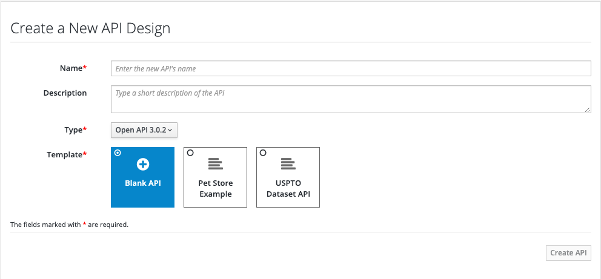
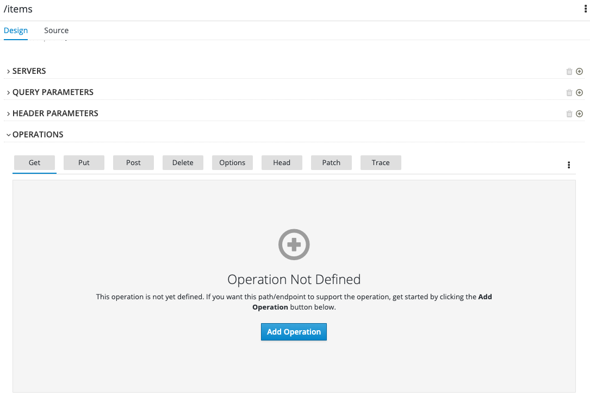

# Introduction
In this exercise, you will define the API to be used for the todolist application using Apicurio.

> Apicurio Studio , maintained by the Red Hat Developer Program, is a tool for designing APIs that follows the specification without requiring the developer(s) to be intimately familiar with it. It provides a GUI for defining all aspects of the API. Ultimately, Apicurio outputs both human and machine readable documentation which complies with the latest version of the OpenAPI specification.

## Step 1 - Create an account

APICurio offers a SaaS option located at https://studio.apicur.io. Please create an account by Clicking the "Register" button or using an Identity Provider like Google or GitHub.

## Step 2 - Explore Apicurio

As soon as you are logged into APICurio you will see three main sections.

1. Dashboard (Overall overview, Activity and Recent APIS).
2. APIs
   * View all APIs (Lists the APIs owned and shared with you)
   * Create new API (Allows the creation of a new API)
   * Import API (If we have already one API, we can import it and manage in APICurio)
3. Settings (Custom Settings, Linked Accounts)

## Step 3 - Explore requirements for todo-list API 

The API should expose endpoints with following data models:

* Data Models:
  * Error
    - code: string
    - extra: string
    - message: string
  * Item
    - id: string
    - name: string
    - description: string
* Endpoints:
  * GET /items
    - Operation ID: getItems
    - Response:
      - Code 200, application/json, Array of Items
  * POST /items
    - Operation ID: createItem
    - Request Body: application/json, Item Object
    - Response:
      - Code 201
  * GET /items/{itemId}
    - Operation ID: getItem
    - Response:
      - Code 200, application/json, Item
  * PUT /items/{itemId}
    - Operation ID: updateItem
    - Request Body: application/json, Item Object
    - Response:
      - Code 202
  * DELETE /items/{itemId}
    - Operation ID: deleteItem
    - Response:
      - Code 204

## Step 4 - Define the todo-list API specification with Apicurio

###### 4.1 Go to section "APIs" and click "Create New API"
  
  * Name: Todo API
  * Description : ToDo API specification
  * Type: Open API 3.0.2
  * Template: Blank API

###### 4.2. Edit the API and in servers section, Add a new server:
   * Server URL: http://localhost:8001/api/v1
   * Description: Local Env Server
   * Click "Save"


###### 4.3. Define the Data Model `Error` by clicking on `Add a data type` link
   
   * Name: Error
   * Description: Error Object
   * Enter JSON Example:
   ```
   {
      "code": "ERR001",
      "message": "Error from Server",
      "extra": "Extra error message"
    }
   ```
   * Choose to create a Rest Resource with the Data Type: No Resource 
   > Note: if you click Rest Resource, creates automatically all the paths and methods required to manage the Error data model, this is useful for the `Item` data model but you are not going to use it. All the creation will be made manually to gain more experience.

   * Click "Save" button.
   
    > Additionally you can add description for `Error` data model.

###### 4.4. Likewise define the Data Model `Items` by clicking on `Add a data type` link again 
###### 4.5. Next, create an API path(endpoints) `/items` by clicking on `Add path` link

    
  * Enter the path: /items
  * As soon as the popup is closed you can see the new path. In the detail page, you are going to add some extra information and enable the GET operation.
    * Info section:
      * Summary: Path used to manage the list of Items.
      * Description: The REST endpoint to list and create `Item` entities.  This path contains a `GET` and `POST` operation to perform the list and create tasks, respectively.
    * Operations section:
      * Under the tab "Get" , click "Add Operation" button.
        
      * And fill the following sections:
        * Info:
          * Summary: List All Items
          * Description: Gets a list of all `Item` entities.
          * Operation ID: getItems
        * Responses:
          * Add a response.
            * Add 200 Status code.
              * Description: Successful response - returns an array of `Item` entities.
              * Response Body: Add Media Type -> Application/json -> Type: `Array` of `Item`.
            * Add 500 Status code.
              * Description: Error response - returns an object of `Error` entity.
              * Response Body: Add Media Type -> Application/json -> Type: `Error`.

###### 4.6. Likewise, please add the rest of the endpoints based on the requirements mentioned in step 3.

> You can find the complete specification [here](../contract/swagger.yaml)


