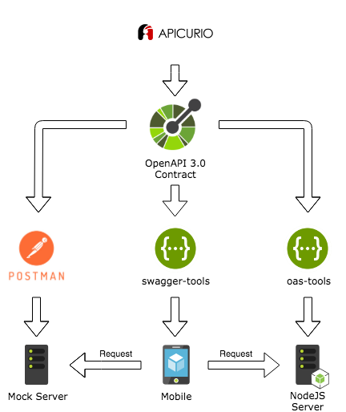

# Overview

In this workshop you will create a to-do list application by building a Node.js cloud app and Ionic Angular front end using ApenAPI specification.

**You will learn how to**
 
 * Exercise 1: Define contract for the REST API using [Apicurio](https://studio.apicur.io).

 * Exercise 2: Use [Postman](https://www.getpostman.com) to spin up a mock server based on OpenAPI specification.

 * Exercise 3: Build a Ionic Angular front-end app to communicate with back-end REST API using [openapi-generator-cli](https://www.npmjs.com/package/@openapitools/openapi-generator-cli). This tool helps to generate server stubs and client SDKs defined for the API with OpenAPI specification.

 * Exercise 4: Build a Node.js app from scratch using [oas-tools](https://www.npmjs.com/package/oas-tools) module. The module allows to support REST API defined with OpenAPI specification.

  

